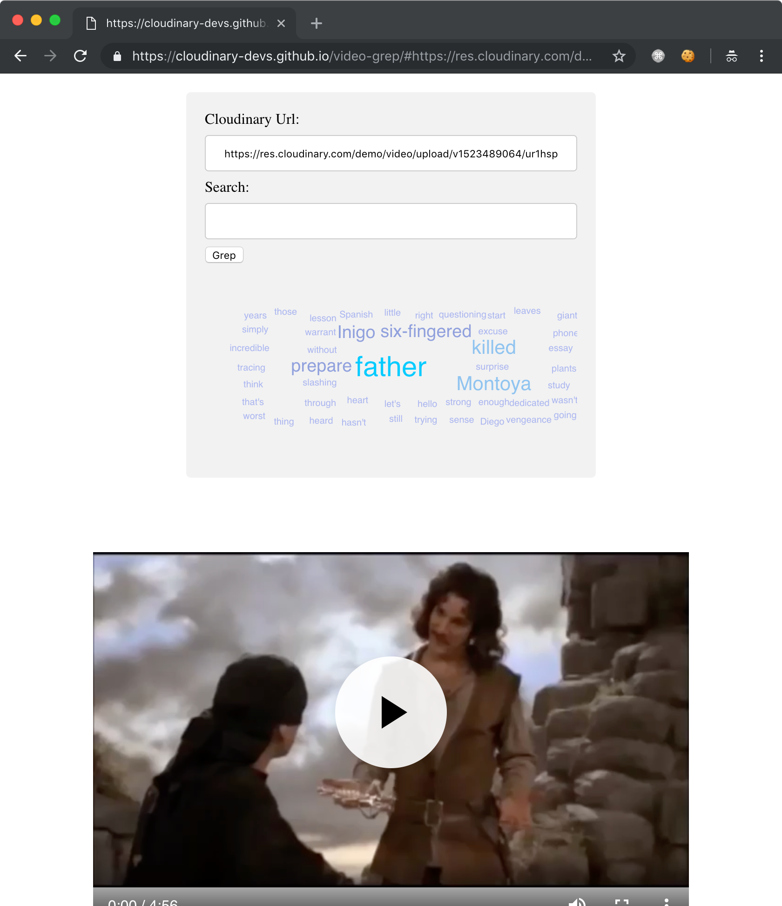

# Grep for Video

[Grep](https://en.wikipedia.org/wiki/Grep) is a unix command line tool for finding text in a file. This tool demonstrates how to accomplish the same thing for video. Video-Grep allows you to quickly search for keywords and intelligently review the context in a video player. 

Examples:
* [princess bride](https://cloudinary-devs.github.io/video-grep/#https://res.cloudinary.com/demo/video/upload/v1523489064/ur1hsppj746e9rpgs1nv.mp4) search for 'father'
* [Mark Zuckerberg](https://cloudinary-devs.github.io/video-grep/#https://res.cloudinary.com/demo/video/upload/dndbdw4kyurqav6dkokz.mp4) search for 'senator'
